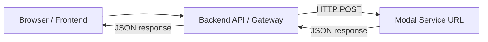

# Backend + Modal Integration (Template)

This doc is a **generic, copy/paste reference** for integrating a backend server with a Modal-hosted Python service, so your app works “always-on” in the cloud instead of depending on a local machine.

It uses:

- **Frontend**: any UI (React/Vite/Next/etc.)
- **Backend**: any server (Node/Express/FastAPI/etc.) that can make outbound HTTP requests
- **Compute**: Modal (Python) for heavy work (GPU inference, model hosting, media processing, etc.)

You’ll see:

- A **generic blueprint with placeholders** you can swap for your own tools
- A **real-life example** mirroring the TuneStory pattern (Supabase Edge Function → Modal MusicGen)

---

## Why this pattern

### What you want

- The system is available even when your laptop is off.
- Secrets and upstream endpoints are **not exposed to the browser**.
- You can deploy ML/GPU workloads without running your own server.

### The standard flow



The backend (or gateway) is the “choke point” that handles:

- input validation
- auth (optional)
- secrets (Modal URL, tokens, API keys)
- retries / error normalization

---

## Quick start checklist (fill in placeholders)

### Inputs you need

- **Modal service name**: `<MODAL_APP_NAME>`
- **Modal URL** (after deploy): `<MODAL_URL>`
- **Backend URL**: `<BACKEND_URL>`
- **Frontend URL**: `<FRONTEND_URL>`

### Secrets to configure

- In backend env:
  - `MODAL_URL=<MODAL_URL>`
  - `MODAL_AUTH_TOKEN=<optional_if_you_add_auth>`
- In frontend env (only public values):
  - `VITE_BACKEND_URL=<BACKEND_URL>` or equivalent

Never put `MODAL_URL` in frontend env if you don’t want clients calling it directly.

---

## Part A — Modal service (Python) (generic)

### What it does

You deploy a Python web endpoint to Modal that accepts JSON, runs expensive work, and returns JSON.

### Contract (recommended)

**Request**

```json
{
  "input": "<YOUR_INPUT>",
  "options": { "any": "json" }
}
```

**Response**

```json
{
  "success": true,
  "result": "<YOUR_RESULT>",
  "metadata": { "latency_ms": 1234 }
}
```

### Modal implementation skeleton (placeholders)

Create `modal_service.py`:

```python
import time
from typing import Any, Optional

import modal
from pydantic import BaseModel, Field

image = (
    modal.Image.debian_slim(python_version="3.11")
    # Add apt deps if needed:
    # .apt_install("ffmpeg", "git", ...)
    # Add pip deps you need:
    .pip_install("fastapi", "pydantic")
)

app = modal.App("<MODAL_APP_NAME>", image=image)


class RequestModel(BaseModel):
    input: str = Field(min_length=1, max_length=10000)
    options: dict[str, Any] = Field(default_factory=dict)


@app.cls(
    # gpu="T4",  # enable if needed
    scaledown_window=300,  # keep warm ~5 minutes
    timeout=120,
)
class Worker:
    @modal.enter()
    def load(self):
        # Load heavyweight models here (once per warm container)
        self._started_at = time.time()

    @modal.method()
    def run(self, payload: dict) -> dict:
        start = time.time()
        req = RequestModel(**payload)

        # TODO: Replace with your real work
        output = {"echo": req.input, "options": req.options}

        return {
            "success": True,
            "result": output,
            "metadata": {"latency_ms": int((time.time() - start) * 1000)},
        }


worker = Worker()


@app.function()
@modal.asgi_app()
def fastapi_app():
    from fastapi import FastAPI, HTTPException
    from fastapi.responses import JSONResponse

    web = FastAPI(title="<MODAL_APP_NAME>")

    @web.post("/")
    async def handle(req: RequestModel):
        try:
            result = worker.run.remote(req.model_dump())
            return JSONResponse(content=result)
        except Exception as e:
            raise HTTPException(status_code=500, detail=str(e))

    return web
```

### Deploy

```bash
pip install modal
modal setup
modal deploy modal_service.py
```

Modal prints a URL similar to:

- `https://<MODAL_USERNAME>--<MODAL_APP_NAME>-fastapi-app.modal.run`

Copy that into your backend’s `MODAL_URL`.

---

## Part B — Backend gateway (generic)

### What it does

Your backend exposes an endpoint (example: `POST /api/run`) that:

1. Validates client input
2. Calls Modal using `MODAL_URL`
3. Returns a normalized response

### Backend responsibilities (recommended)

- **Validate** input (Zod / Joi / Pydantic / your framework)
- **Do not** forward raw upstream errors; normalize them
- Handle **retryable** statuses (commonly 429 / 503)
- Add **auth** if you don’t want anonymous usage

### Node/Express example (replace placeholders)

```ts
import express from "express";

const app = express();
app.use(express.json({ limit: "2mb" }));

const MODAL_URL = process.env.MODAL_URL; // required
if (!MODAL_URL) throw new Error("Missing MODAL_URL");

app.get("/health", (_req, res) => res.json({ ok: true }));

app.post("/api/run", async (req, res) => {
  try {
    const input = req.body?.input;
    const options = req.body?.options ?? {};

    if (typeof input !== "string" || input.trim() === "") {
      return res.status(400).json({ success: false, error: "input is required" });
    }

    const upstream = await fetch(MODAL_URL, {
      method: "POST",
      headers: { "Content-Type": "application/json" },
      body: JSON.stringify({ input, options }),
    });

    const text = await upstream.text();
    const data = safeJson(text) ?? { raw: text };

    // Normalize errors
    if (!upstream.ok) {
      const retryable = upstream.status === 429 || upstream.status === 503;
      return res.status(upstream.status).json({
        success: false,
        error: "Upstream (Modal) request failed",
        retryable,
        details: data,
      });
    }

    return res.json(data);
  } catch (e: any) {
    return res.status(500).json({ success: false, error: "Backend error", details: String(e?.message ?? e) });
  }
});

function safeJson(text: string) {
  try {
    return JSON.parse(text);
  } catch {
    return null;
  }
}

app.listen(process.env.PORT ?? 3000);
```

---

## Part C — Frontend call (generic)

```ts
const resp = await fetch(`${import.meta.env.VITE_BACKEND_URL}/api/run`, {
  method: "POST",
  headers: { "Content-Type": "application/json" },
  body: JSON.stringify({ input: "hello", options: { temperature: 0.8 } }),
});

const data = await resp.json();
if (!data.success) {
  // optionally handle retryable
  if (data.retryable) {
    // show "try again in a moment"
  }
}
```

---

## Real-life example: TuneStory-style pattern (Supabase → Modal)

In TuneStory, the “backend gateway” is a **Supabase Edge Function** that calls a Modal URL stored as a secret:

### Example secret

- `MODAL_API_URL=https://<username>--tunestory-musicgen-<endpoint>.modal.run`

### Example gateway behavior

1. Frontend calls:
   - `POST https://<SUPABASE_PROJECT>.supabase.co/functions/v1/generate-music`
2. Edge Function validates request with Zod.
3. Edge Function builds a MusicGen prompt (prompt engineering).
4. Edge Function calls Modal:
   - `fetch(MODAL_API_URL, { method: "POST", body: { prompt, model, duration, temperature }})`
5. Modal returns `{ audio_base64 }`.
6. Edge Function returns `{ audioUrl: data:audio/wav;base64,... }` to the frontend.

### Why it works well

- Browser never sees `MODAL_API_URL`.
- Modal scales to zero; a warm window reduces cold starts.
- Supabase is the “always-on” endpoint you depend on.

---

## Operational tips (generic)

- **Health checks**:
  - Backend: `GET /health`
  - Modal: you can add `GET /health` to the FastAPI app too.
- **Cold starts**:
  - Use `scaledown_window` on Modal classes if UX is sensitive.
- **Rate limiting**:
  - Add rate limits at the backend, not at Modal.
- **Auth**:
  - Put auth on the backend gateway route (JWT/session/API key).
- **Payload sizes**:
  - If sending images/audio, consider presigned URLs (S3) instead of huge JSON base64.

---

## Copy/paste placeholders

Replace these everywhere:

- `<MODAL_APP_NAME>`: your Modal app name
- `<MODAL_USERNAME>`: your Modal username/org
- `<MODAL_URL>`: printed after `modal deploy`
- `<BACKEND_URL>`: where your backend runs (Railway/Render/Fly/etc.)
- `<FRONTEND_URL>`: your web app URL

