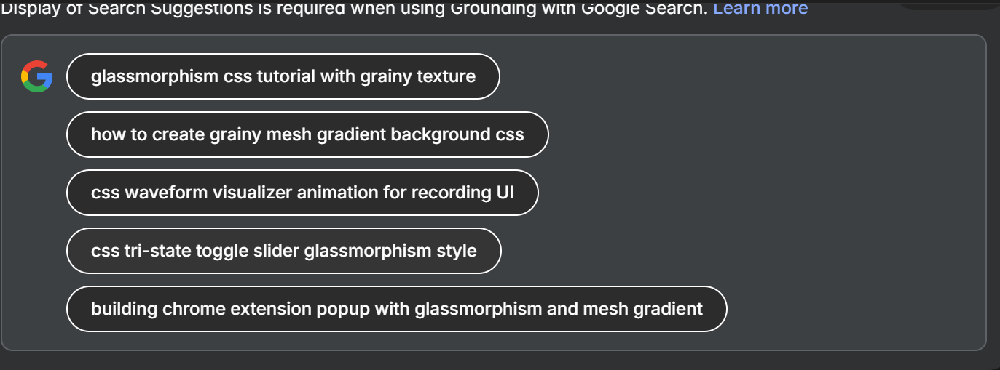

**To rebuild this** **"Aether Audio"** **extension build to spec, we will break the UI into five core layers. We are replacing all teal accents with a** **neutral white "Luna" glow** **to create a cleaner, premium aesthetic.**

---

### Component 1: The "Grainy Mesh" Background

**The foundation is a fluid mesh gradient combined with a high-frequency noise texture to eliminate digital banding.**

* **Spec:**

  * **Colors:** **Top-left:** **#FBC2EB** **(soft pink), Top-right:** **#A18CD1** **(muted purple), Bottom-right:** **#30cfd0** **(de-saturated cyan), Bottom-left:** **#330867** **(deep indigo).**
  * **Texture:** **A** **1x1** **noise SVG or a pseudo-element with a tiled noise PNG.**
  * **CSS:**

  **code**CSS

  ```
  .mesh-bg {
    background: radial-gradient(at 0% 0%, #fbc2eb 0px, transparent 50%),
                radial-gradient(at 100% 0%, #a18cd1 0px, transparent 50%),
                radial-gradient(at 100% 100%, #30cfd0 0px, transparent 50%),
                radial-gradient(at 0% 100%, #330867 0px, transparent 50%);
    background-color: #1a1a2e; /* Dark base */
  }
  .mesh-bg::after {
    content: "";
    position: fixed;
    inset: 0;
    opacity: 0.08;
    background-image: url('noise.png'); /* Tiled 50x50 noise texture */
    pointer-events: none;
  }
  ```[[1](https://www.google.com/url?sa=E&q=https%3A%2F%2Fvertexaisearch.cloud.google.com%2Fgrounding-api-redirect%2FAUZIYQFyFTGwpVxCV_qStY8bywDfg5lt4bpD40w2I57USAW_n_pzXJxQps6_7ixYiLzSIS2Sx1izi4JoqqeRmqCgF2Pv94Z3wl7CLuBgTaZZ5G6S8Ul9iphr98y04-F6C2RX0lzmwQhqaVh6mceozW0mGiw79Y9L_H0wig7p)][[2](https://www.google.com/url?sa=E&q=https%3A%2F%2Fvertexaisearch.cloud.google.com%2Fgrounding-api-redirect%2FAUZIYQHnXCT4CKbBs_JAait7mBJDwoncyRhGb1CxP5KoBg_tQ8593vDg_EHbqaySkCcqPndzC40LQUOSiHltncANYGIezLwAvXEIaZkI0A2It0cxVJ9gzUsVKQguTRa0zHs4uXcPwTBOmtZetWfxCN0BkKKL9OCJYet7qCACXsDdLGK5YGqifKOGnuI-o4Y%3D)][[3](https://www.google.com/url?sa=E&q=https%3A%2F%2Fvertexaisearch.cloud.google.com%2Fgrounding-api-redirect%2FAUZIYQHiCiJp6PAZPUfHrlbjRrNa_-de3XxKAcL2jbbIo__OPnx0Shos6-cewUwtfL5zmC2TajRNYAG87LcI94sr0PSuXL2VuA5KZW9VkGFii8HN23zJ2EIx0DfBjCqwIFwiIls4AFVqiMZGAE1NKV3SS1QET5fG8R0YU8U%3D)][[4](https://www.google.com/url?sa=E&q=https%3A%2F%2Fvertexaisearch.cloud.google.com%2Fgrounding-api-redirect%2FAUZIYQH7wUkxnsEU_94AK_k7MeA4FEqn3idBnVwojhhnR7oCkE3qVbqMcpDzZzyEj6UtnVNbAcwyDIV32Sq0EVgMnCGku0zSPyBv_3Ykva1IlREXnXAPDSTWWO2cDniwkZ8X2W8QPXs2RagARo7RJUIpjWV8G3fSk6SBcKAaQnk81h0-Jgb6Qve8E9OMQNmr3MafE0XcOBAItg%3D%3D)][[5](https://www.google.com/url?sa=E&q=https%3A%2F%2Fvertexaisearch.cloud.google.com%2Fgrounding-api-redirect%2FAUZIYQGhETg7GZHSb5H_SbnsW92paTJRUHYvTXFgqaJAmHTrNogszHchfxizx1Abin80PdJnap5N91BdJ-D3lkSrtBRRRC6nc_IAZoZ7s72KfdJGaYeoNiJ9d7mevcNZ5Hna9mpzbOu0OupopIyEe4aAv7br5L30jbnB4vit2eRha_jvKdhQmvcZqfEmakNB9aYxYE33-Q%3D%3D)][[6](https://www.google.com/url?sa=E&q=https%3A%2F%2Fvertexaisearch.cloud.google.com%2Fgrounding-api-redirect%2FAUZIYQFIiENKTnECmqSutH4RsPjKutdZAx0HOwlMFo5_8Jp-caYpZ_FGMm15Fc0D3fP-mHBXN9GwhE11mh1a3gfYxQ4fGwdA39Qx5emCT21RARbkbehw_dXsBOKAXno3xtxSsS3awtU6PqgQdtpGanUA34JgzcjxLg%3D%3D)][[7](https://www.google.com/url?sa=E&q=https%3A%2F%2Fvertexaisearch.cloud.google.com%2Fgrounding-api-redirect%2FAUZIYQHHOrf68WppSsmQJ8osB5rcxbLsUuOdTx4pxJMjZh3wKaA97AR21Xh-2Xb1YBxdhyLbpeS91Af9PKPKkNIR9BhifwDeV3IujslwU90a_L81KqnYdRcidLYqVyvAXpU8NuxcxtnJt24%3D)][[8](https://www.google.com/url?sa=E&q=https%3A%2F%2Fvertexaisearch.cloud.google.com%2Fgrounding-api-redirect%2FAUZIYQFGO2pjM_LxU4hKw1uvYUwOoJ18DbIYi3SddnPYzJZfffYsGnoWfb1T5xyG461EzUYeoco-3Hly6dcam444LgbqJhApfxup8l25OUw1y_dcSC9U_QU4YwhSzignIWKqi3RUy8a8BO804U4ucSWe)][[9](https://www.google.com/url?sa=E&q=https%3A%2F%2Fvertexaisearch.cloud.google.com%2Fgrounding-api-redirect%2FAUZIYQEGU9QVnunnKrZBdViu8fnKPtk3x8kYiw_UhhfSUii04Uau9inz58ovSZpQTlZ_b3aSPK7HXv0mHD8A3g49S_y3LG62vfWsPj9uXZ-IBCacKMp7gPPRvZy6DvnnZfssqdYi33XkoaMG)][[10](https://www.google.com/url?sa=E&q=https%3A%2F%2Fvertexaisearch.cloud.google.com%2Fgrounding-api-redirect%2FAUZIYQE7rbqfTjaIJ1irI226oNs0aBBBk2F-WLsiSIynifKyZHH_-u6f4wIx9HJClWJ10yBq_mIJXblRM5nZxj3oruhFrCW92aj99gcUhAl28eYyBjlYi24LpUU2Mfr_QzwtA2AlT4EAD_R_jog66oSKst4K2HUtoeX5jc7tCNbkFh099g-E-8M6DrVSZQJT0JG-ij5y6Z94bGLzi5dEgIHkqW8eicNZ7A%3D%3D)][[11](https://www.google.com/url?sa=E&q=https%3A%2F%2Fvertexaisearch.cloud.google.com%2Fgrounding-api-redirect%2FAUZIYQGCGMxZGEaoI_nx69Oe8qIRFb-W4Rn88qvSUzwERoVtsTSEsVbskV8r7bacfiT45ETmyA877lVN-np1548c9UbEEDyzt4ckRwXprmZ-PT_ugty4SWf7VpulASOc_CFrfNjSbRs%3D)][[12](https://www.google.com/url?sa=E&q=https%3A%2F%2Fvertexaisearch.cloud.google.com%2Fgrounding-api-redirect%2FAUZIYQHfeEj6lWJvl7mcUOzvp8bHzld4Pwz89z-CVN_oSpvp5qAE8xCIzLJpXP0pGPqvAvetQBcev_Q8r6Jzk2urQRQf5hXHBDcAhDxPerolLpgY9dd3Tw2_2Fk--yXvzhO0bKik4iJpYapIhOvMuTQUxRrVNJ0mavWqrhRkfoJ0Bs7jGLe0Hk5Rbw-zv_5ZRwUt)]
  ```

---

### Component 2: The "Glass Shell" (Main Container)

**This is the physical frame of the extension popup.**

* **Spec:**

  * **Dimensions:** **400px x 600px (standard Chrome popup size).**
  * **Corner Radius:** **32px** **for a "mobile app" feel.**
  * **Effect:** **backdrop-filter: blur(24px) saturate(120%)**.
  * **Border:** **1.5px solid rgba(255, 255, 255, 0.15)** **for a sharp edge highlight.**
  * **Shadow:** **0 20px 40px rgba(0, 0, 0, 0.4)**.

---

### Component 3: The Navigation Pill

**A floating secondary glass element that holds the mode switches.**

* **Spec:**

  * **Shape:** **Full pill (radius: 100px).**
  * **Active Indicator:** **A white frosted-glass circle that slides behind the icons.**
  * **Neutral Transition:**

  **code**CSS

  ```
  .nav-active-bg {
    background: rgba(255, 255, 255, 0.2);
    box-shadow: 0 0 15px rgba(255, 255, 255, 0.1);
    border: 1px solid rgba(255, 255, 255, 0.4);
    transition: transform 0.4s cubic-bezier(0.175, 0.885, 0.32, 1.275);
  }
  ```

---

### Component 4: The "Start Recording" Action Pill

**This is the primary call-to-action (CTA).**

* **Spec:**

  * **Primary Fill:** **rgba(255, 255, 255, 0.1)** **(semi-transparent white).**
  * **Inner Glow:** **box-shadow: inset 0 0 10px rgba(255, 255, 255, 0.2)**.
  * **The "Record" Dot:** **A solid white circle with a soft outer glow.**
  * **Typography:** **'Fira Mono', White,** **14px**, Medium weight, **letter-spacing: 0.05em**.
  * **Hover State:** **Increase opacity from 0.1 to 0.2 and add a subtle** **white** **outer bloom.**

---

### Component 5: The "Luna" Waveform Visualizer

**Replacing the teal bars with soft, white vertical lines that react to audio.**

* **Spec:**

  * **Color:** **rgba(255, 255, 255, 0.8)**.
  * **Bloom:** **filter: blur(2px) drop-shadow(0 0 8px white)**.
  * **Animation Logic:**

  **code**CSS

  ```
  @keyframes wave-bounce {
    0%, 100% { transform: scaleY(0.4); opacity: 0.5; }
    50% { transform: scaleY(1.2); opacity: 1; }
  }
  .wave-bar {
    width: 3px;
    height: 40px;
    background: white;
    border-radius: 10px;
    animation: wave-bounce 1.2s ease-in-out infinite;
  }
  /* Stagger each bar with a delay */
  .wave-bar:nth-child(2) { animation-delay: 0.1s; }
  .wave-bar:nth-child(3) { animation-delay: 0.2s; }
  ```

---

### Rebuilding for Functionality

**To implement this in your** **manifest.v3** **extension:**

* **Logic:** **Use** **chrome.tabCapture** **to stream audio.**
* **Visualization:** **Use the** **Web Audio API**'s **AnalyserNode** **to drive the height of the** **.wave-bar** **elements in real-time instead of using CSS** **@keyframes**.
* **The White Theme:** **Ensure the "Save Key" and "Transcribe" buttons also adopt the Component 4 spec—replacing the hard teal** **#00ffe7** **with a soft white glow (**rgba(255,255,255,0.9)**).**

Sources**help**

1. [dev.to](https://www.google.com/url?sa=E&q=https%3A%2F%2Fvertexaisearch.cloud.google.com%2Fgrounding-api-redirect%2FAUZIYQFyFTGwpVxCV_qStY8bywDfg5lt4bpD40w2I57USAW_n_pzXJxQps6_7ixYiLzSIS2Sx1izi4JoqqeRmqCgF2Pv94Z3wl7CLuBgTaZZ5G6S8Ul9iphr98y04-F6C2RX0lzmwQhqaVh6mceozW0mGiw79Y9L_H0wig7p)
2. [smarative.com](https://www.google.com/url?sa=E&q=https%3A%2F%2Fvertexaisearch.cloud.google.com%2Fgrounding-api-redirect%2FAUZIYQHnXCT4CKbBs_JAait7mBJDwoncyRhGb1CxP5KoBg_tQ8593vDg_EHbqaySkCcqPndzC40LQUOSiHltncANYGIezLwAvXEIaZkI0A2It0cxVJ9gzUsVKQguTRa0zHs4uXcPwTBOmtZetWfxCN0BkKKL9OCJYet7qCACXsDdLGK5YGqifKOGnuI-o4Y%3D)
3. [sliderrevolution.com](https://www.google.com/url?sa=E&q=https%3A%2F%2Fvertexaisearch.cloud.google.com%2Fgrounding-api-redirect%2FAUZIYQHiCiJp6PAZPUfHrlbjRrNa_-de3XxKAcL2jbbIo__OPnx0Shos6-cewUwtfL5zmC2TajRNYAG87LcI94sr0PSuXL2VuA5KZW9VkGFii8HN23zJ2EIx0DfBjCqwIFwiIls4AFVqiMZGAE1NKV3SS1QET5fG8R0YU8U%3D)
4. [stackexchange.com](https://www.google.com/url?sa=E&q=https%3A%2F%2Fvertexaisearch.cloud.google.com%2Fgrounding-api-redirect%2FAUZIYQH7wUkxnsEU_94AK_k7MeA4FEqn3idBnVwojhhnR7oCkE3qVbqMcpDzZzyEj6UtnVNbAcwyDIV32Sq0EVgMnCGku0zSPyBv_3Ykva1IlREXnXAPDSTWWO2cDniwkZ8X2W8QPXs2RagARo7RJUIpjWV8G3fSk6SBcKAaQnk81h0-Jgb6Qve8E9OMQNmr3MafE0XcOBAItg%3D%3D)
5. [daily.dev](https://www.google.com/url?sa=E&q=https%3A%2F%2Fvertexaisearch.cloud.google.com%2Fgrounding-api-redirect%2FAUZIYQGhETg7GZHSb5H_SbnsW92paTJRUHYvTXFgqaJAmHTrNogszHchfxizx1Abin80PdJnap5N91BdJ-D3lkSrtBRRRC6nc_IAZoZ7s72KfdJGaYeoNiJ9d7mevcNZ5Hna9mpzbOu0OupopIyEe4aAv7br5L30jbnB4vit2eRha_jvKdhQmvcZqfEmakNB9aYxYE33-Q%3D%3D)
6. [hollyland.com](https://www.google.com/url?sa=E&q=https%3A%2F%2Fvertexaisearch.cloud.google.com%2Fgrounding-api-redirect%2FAUZIYQFIiENKTnECmqSutH4RsPjKutdZAx0HOwlMFo5_8Jp-caYpZ_FGMm15Fc0D3fP-mHBXN9GwhE11mh1a3gfYxQ4fGwdA39Qx5emCT21RARbkbehw_dXsBOKAXno3xtxSsS3awtU6PqgQdtpGanUA34JgzcjxLg%3D%3D)
7. [freefrontend.com](https://www.google.com/url?sa=E&q=https%3A%2F%2Fvertexaisearch.cloud.google.com%2Fgrounding-api-redirect%2FAUZIYQHHOrf68WppSsmQJ8osB5rcxbLsUuOdTx4pxJMjZh3wKaA97AR21Xh-2Xb1YBxdhyLbpeS91Af9PKPKkNIR9BhifwDeV3IujslwU90a_L81KqnYdRcidLYqVyvAXpU8NuxcxtnJt24%3D)
8. [frontendmasters.com](https://www.google.com/url?sa=E&q=https%3A%2F%2Fvertexaisearch.cloud.google.com%2Fgrounding-api-redirect%2FAUZIYQFGO2pjM_LxU4hKw1uvYUwOoJ18DbIYi3SddnPYzJZfffYsGnoWfb1T5xyG461EzUYeoco-3Hly6dcam444LgbqJhApfxup8l25OUw1y_dcSC9U_QU4YwhSzignIWKqi3RUy8a8BO804U4ucSWe)
9. [colorffy.com](https://www.google.com/url?sa=E&q=https%3A%2F%2Fvertexaisearch.cloud.google.com%2Fgrounding-api-redirect%2FAUZIYQEGU9QVnunnKrZBdViu8fnKPtk3x8kYiw_UhhfSUii04Uau9inz58ovSZpQTlZ_b3aSPK7HXv0mHD8A3g49S_y3LG62vfWsPj9uXZ-IBCacKMp7gPPRvZy6DvnnZfssqdYi33XkoaMG)
10. [medium.com](https://www.google.com/url?sa=E&q=https%3A%2F%2Fvertexaisearch.cloud.google.com%2Fgrounding-api-redirect%2FAUZIYQE7rbqfTjaIJ1irI226oNs0aBBBk2F-WLsiSIynifKyZHH_-u6f4wIx9HJClWJ10yBq_mIJXblRM5nZxj3oruhFrCW92aj99gcUhAl28eYyBjlYi24LpUU2Mfr_QzwtA2AlT4EAD_R_jog66oSKst4K2HUtoeX5jc7tCNbkFh099g-E-8M6DrVSZQJT0JG-ij5y6Z94bGLzi5dEgIHkqW8eicNZ7A%3D%3D)
11. [css-tricks.com](https://www.google.com/url?sa=E&q=https%3A%2F%2Fvertexaisearch.cloud.google.com%2Fgrounding-api-redirect%2FAUZIYQGCGMxZGEaoI_nx69Oe8qIRFb-W4Rn88qvSUzwERoVtsTSEsVbskV8r7bacfiT45ETmyA877lVN-np1548c9UbEEDyzt4ckRwXprmZ-PT_ugty4SWf7VpulASOc_CFrfNjSbRs%3D)
12. [css-tricks.com](https://www.google.com/url?sa=E&q=https%3A%2F%2Fvertexaisearch.cloud.google.com%2Fgrounding-api-redirect%2FAUZIYQHfeEj6lWJvl7mcUOzvp8bHzld4Pwz89z-CVN_oSpvp5qAE8xCIzLJpXP0pGPqvAvetQBcev_Q8r6Jzk2urQRQf5hXHBDcAhDxPerolLpgY9dd3Tw2_2Fk--yXvzhO0bKik4iJpYapIhOvMuTQUxRrVNJ0mavWqrhRkfoJ0Bs7jGLe0Hk5Rbw-zv_5ZRwUt)



